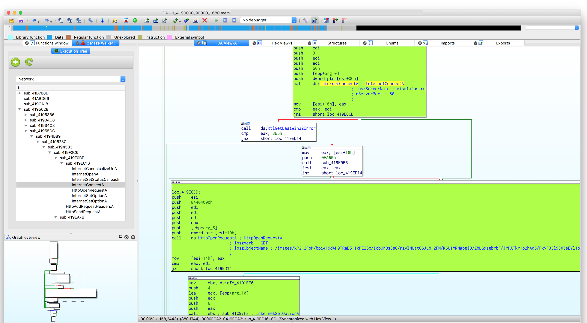
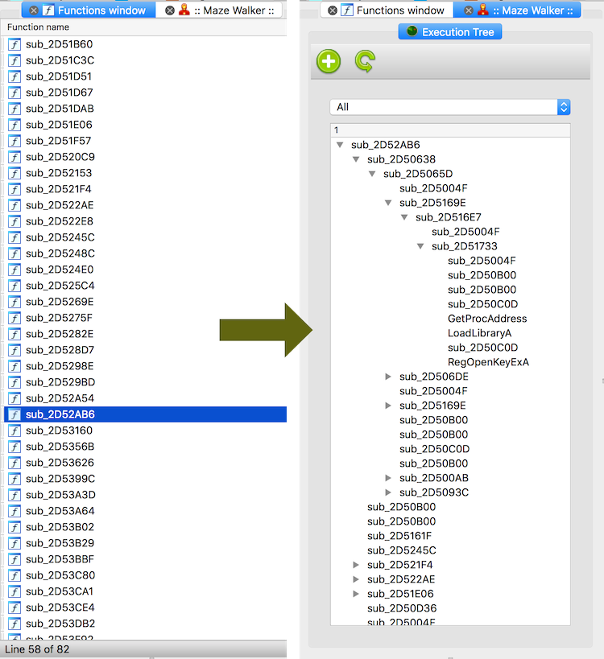
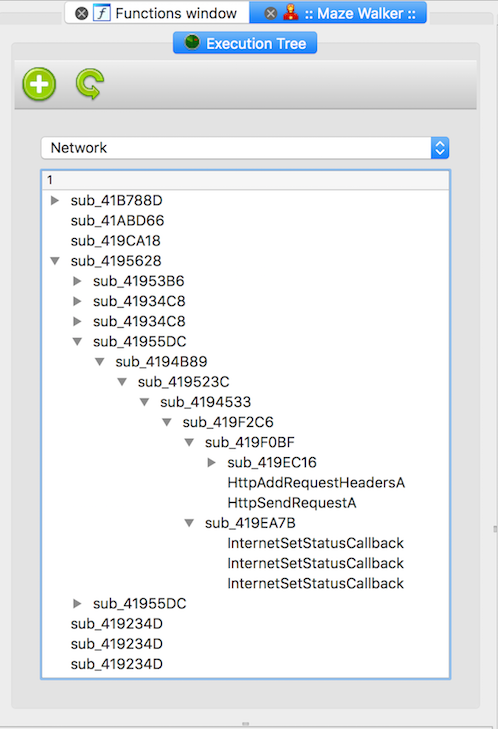
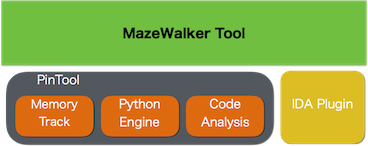

# Overview

MazeWalker’s goal is to reduce malware analysis time by automating runtime data collection and better visualization eventually helping a researcher to concentrate on static analysis and less on its dynamic part.

- **Packed code** - MazeWalker monitors all memory areas where code execution took place, to be able to reconstruct the whole execution later. If there was a code change in the already monitored area (runtime code decryption), then the new version will be saved too, for later analysis. This approach appears to be useful for general code unpacking.

- **Position independent code** - to solve indirect control flow change issues (`jmp eat`, `call [eax]`, etc.), the instruction reference address and the control flow change target address are collected for later usage during static phase.

- **System APIs** - it's no secret, that knowing system API parameters that were used during execution could be helpful in understanding malware internals and overall purpose. So, MazeWalker has a Python-based API call site analysis to save or alter API's params that were used. More could be read on the dedicated wiki page.

- **Code coverage** - MazeWalker collects the list of all basic blocks that were executed, in all monitored processes. This information is used to assist code navigation latter by marking control flow graph in IDA database.

- **Code dispersion** - most malware today will use code injection and distribute itself into different process on the system. MazeWalker is able to follow those injection paths and collect data in all processes, to show a more clear picture of sample behaviour.

- **Environment Detection** - a lot of anti-research techniques are based on the gathered information by various system APIs. As MazeWalker's API interception abilities are script-based, it is very easy to add new anti-anti-research countermeasures (wiki).

- **Visualization** - all collected runtime information is processed by a IDAPython plugin and presented in more (hopefully) meaningful way. The new way of visualization, takes into account the runtime information and shows how the code was executing per-thread view. This way helps more logically understand the design of the program and further focus on a particular task. 

- **Focus** - in case there is some particular topic of interest for the analyzed sample (Network interaction), there is a way to filter out the execution data and focus only on the specifics of the research.

# Design
MazeWalker is based on Intel's Pin framework for runtime data collection and IDAPython for in-IDA visualization.

# Usage
Please refer to wiki for detailed explanation.
